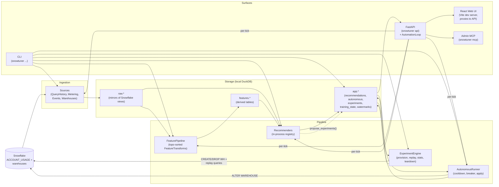

# snowtuner architecture

This document is a map of the codebase. Read it once before changing anything;
keep it nearby when adding a new recommender or feature transform.

> The Mermaid diagrams below render natively in GitHub. Want PNG/SVG versions
> for slides or screenshots? Run `python scripts/render_mermaid.py` (requires
> Node + `npx`); outputs land in `docs/img/`.

## The 30-second mental model

Four logical layers, each independently testable. Data flows left to right
through the layers; the API + Web UI + MCP are clients of the bottom (`app.*`).



The **AutomationLoop** lives inside the API process and drives the same
pipeline path the CLI's `snowtuner run` does. Set `SNOWTUNER_AUTOMATION_INTERVAL`
to enable; otherwise the API is fully passive and only fires the pipeline
when manually triggered.

The `ExperimentEngine` is the only component besides `AutonomousRunner` that
*writes* to Snowflake — and unlike autonomous-apply (which alters production
warehouses), the engine only ever creates and drops disposable test warehouses
named `SNOWTUNER_EXP_*`.

## Source-tree map

```
snowtuner/
├── src/snowtuner/            # Python package
│   ├── cli.py                # Click CLI — every user-facing command
│   ├── format.py             # Display helpers (credit-delta formatting)
│   ├── storage/
│   │   ├── db.py             # Thread-safe DuckDB via per-thread cursors;
│   │   │                     # reset_database() preserves user config + archives audit
│   │   └── schema.py         # ALL DDL (single source of truth; pre-1.0 = no migrations)
│   ├── credentials/
│   │   ├── model.py          # SnowflakeCredentials + AuthMethod enum
│   │   ├── env_backend.py    # SNOWFLAKE_* env-var loader
│   │   ├── keyring_backend.py# OS keychain (macOS/Windows/desktop Linux)
│   │   ├── file_backend.py   # ~/.snowtuner/creds.toml fallback (mode 0600)
│   │   ├── keypair.py        # RSA keygen for the SNOWTUNER_SVC service user
│   │   └── resolver.py       # tiered resolver: env → keyring → file
│   ├── ingestion/
│   │   ├── base.py           # Source ABC + SnowflakeClient Protocol + SyncResult
│   │   ├── snowflake_client.py  # Lazy snowflake-connector wrapper
│   │   ├── sync.py           # sync_all() + backfill(): watermarks + error isolation
│   │   ├── drift.py          # Schema drift detection (warn-only) against ACCOUNT_USAGE
│   │   └── sources/
│   │       ├── query_history.py
│   │       ├── warehouse_metering.py
│   │       ├── warehouse_events.py
│   │       └── warehouses.py # Uses execute_with_columns; SHOW WAREHOUSES col order varies
│   ├── features/
│   │   ├── base.py           # FeatureTransform ABC + FeaturePipeline (topo-sorted)
│   │   ├── sqlglot_utils.py  # parameterized_hash, AST feature vectors
│   │   └── library/
│   │       ├── warehouse_idle_gaps.py
│   │       ├── query_families.py
│   │       └── query_sql_features.py  # sqlglot AST → structural counts +
│   │                                  # semantic predicates (referenced_tables, where_columns)
│   ├── actions/
│   │   ├── base.py           # Action ABC: target_resource, to_sql, apply, etc.
│   │   ├── alter_warehouse.py# The action type used by both built-in recommenders
│   │   ├── create_warehouse.py  # Stub (roadmap)
│   │   ├── local_table.py    # Stub (roadmap — caching direction)
│   │   └── registry.py       # Action subclass dispatch by ActionType
│   ├── recommendations/
│   │   ├── model.py          # Recommendation, EvidenceRef, Impact
│   │   └── store.py          # CRUD over app.recommendations (supersede semantics)
│   ├── recommenders/
│   │   ├── base.py           # Recommender ABC + TrainingGate ABC + propose_experiments hook
│   │   ├── registry.py       # In-process registration (no entry-points discovery)
│   │   ├── sizes.py          # Snowflake size ladder + alias normalization + credits/memory
│   │   ├── training_state.py # CRUD over app.training_state (per-recommender)
│   │   └── builtins/
│   │       ├── auto_suspend_survival.py   # Cost-minimizing AUTO_SUSPEND tuner (registered)
│   │       ├── auto_suspend_tuner.py      # Earlier p25-heuristic version (kept for contrast)
│   │       ├── rule_based_right_sizer.py  # WAREHOUSE_SIZE rule-based tuner (registered)
│   │       └── spill_aware_right_sizer.py # WAREHOUSE_SIZE empirical-memory tuner (alt)
│   ├── experiments/           # v0.2 — replay-experiments framework
│   │   ├── axes.py            # Generation / QASState enums
│   │   ├── config_delta.py    # WarehouseConfigDelta + WarehouseConfig (merge, render)
│   │   ├── arm.py             # Arm = (name, delta, eligibility_issues)
│   │   ├── eligibility.py     # check_arm_eligibility(arm, control, AccountInfo)
│   │   ├── cost_estimate.py   # Variance-banded experiment cost; savings projection
│   │   ├── sampling.py        # StratifiedByFamily query sampler
│   │   ├── workload.py        # Phase 3 unified resolver: auto-sample OR query-group
│   │   ├── recipes.py         # Preset arm sets (gen1_to_gen2, size_sweep_pm1, ...)
│   │   ├── derive.py          # Winning arm → list[Action] for recommendation derivation
│   │   ├── model.py           # ProposedExperiment, Experiment, ExperimentReport, RunStatus
│   │   ├── provisioning.py    # Create / drop SNOWTUNER_EXP_* test warehouses
│   │   ├── replay.py          # Per-query replay primitive (cache off, metric fetch)
│   │   ├── stats.py           # Paired t-test + Bonferroni + 95% CIs + best-arm selection
│   │   ├── engine.py          # ExperimentEngine: orchestrates a full run end-to-end
│   │   ├── backfill.py        # Post-hoc metric recovery from ACCOUNT_USAGE.QUERY_HISTORY
│   │   └── store.py           # CRUD over app.experiments + app.experiment_runs
│   ├── query_groups/          # v0.2 — saved filter sets
│   │   ├── model.py           # QueryFilterSpec, QueryGroup, QueryGroupKind (static|dynamic)
│   │   ├── sql.py             # build_filter_from_spec(): canonical filter→WHERE-clause
│   │   └── store.py           # CRUD over app.query_groups
│   ├── orchestrator/
│   │   └── runner.py         # End-to-end: sync → features → predict → propose_experiments → autonomous
│   ├── autonomous/
│   │   ├── config.py         # AutonomousConfigStore (per (action, warehouse, knob))
│   │   ├── applications.py   # AutonomousApplicationStore (audit log + rollback)
│   │   └── runner.py         # AutonomousRunner: gate → cooldown → apply → record
│   │                         # (skips when an experiment is RUNNING)
│   ├── api/
│   │   ├── app.py            # FastAPI factory; endpoints group by domain
│   │   ├── schemas.py        # Pydantic I/O models (RecommendationOut, ExperimentOut, QueryRow, ...)
│   │   ├── auth.py           # Pluggable middleware: none (loopback-only) vs token (bearer)
│   │   └── automation.py     # AutomationLoop: background thread runs full pipeline per tick
│   ├── mcp/
│   │   └── admin.py          # 42 MCP tools over the FastAPI (auth-aware)
│   └── seed/
│       └── generate.py       # Synthetic data for demo + dev (6 warehouses)
└── web/                       # React + Vite + TanStack Router web UI
    ├── src/
    │   ├── routes/            # File-based routing (recommendations, warehouses, queries, experiments, docs, settings)
    │   ├── components/
    │   │   ├── top-nav.tsx           # Nav with FreshnessPill alongside the logo
    │   │   ├── freshness-pill.tsx    # Status pill + DropdownMenu w/ per-source + automation + Sync-now
    │   │   └── ui/                   # Card, Button, Badge, Sheet primitives (shadcn-style)
    │   └── lib/
    │       ├── api.ts                # Typed client over the FastAPI surface
    │       └── api-types.ts          # Generated from /openapi.json via `npm run gen-types`
    └── vite.config.ts         # Proxies /api/* → 127.0.0.1:8770 in dev
```

## Key abstractions

### `Action` (actions/base.py)

A typed description of something snowtuner proposes the user do. Subclasses
own their own SQL rendering, dry-run preview, validation, and (for
autonomous-eligible types) `apply()`.

- `target_resource() -> str` — used to deduplicate proposals. For
  `AlterWarehouse`, scoped by knob set so `AUTO_SUSPEND` and `WAREHOUSE_SIZE`
  proposals on the same warehouse don't clobber each other.
- `target_warehouse_name() -> str | None` — used by autonomous-mode config
  matching.  Named with `_name` to avoid shadowing future action types whose
  Pydantic schemas might want a separate `target_warehouse: str` field.
- `supports_autonomous_apply() -> bool` — gate for the autonomous runner.
- `apply(client) -> str` — execute against Snowflake, return SQL run.

Adding a new action type means subclassing `Action`, registering in
`actions/registry.py`, and (if autonomous-eligible) implementing `apply()`.

### `FeatureTransform` + `FeaturePipeline` (features/base.py)

Each transform declares the DuckDB tables it reads (`inputs`) and writes
(`outputs`). The pipeline topologically sorts transforms by I/O so
upstream-feeding transforms run first. This is how feature engineering
stays composable without an orchestration framework.

```python
class WarehouseIdleGapsTransform(FeatureTransform):
    name = "warehouse_idle_gaps"
    inputs = {"raw.query_history", "raw.warehouse_events_history"}
    outputs = {"features.warehouse_idle_gaps"}
    def run(self, conn): ...
```

### `Recommender` + `TrainingGate` (recommenders/base.py)

A recommender encapsulates one inference strategy. Two pieces:

- `TrainingGate.evaluate(conn) -> ReadinessReport` — "do we have enough data
  to make recommendations?" Returns `is_ready` + a human-readable reason.
  Each recommender owns its own gate.
- `Recommender.fit(conn) -> dict` — compute and return a JSON-serializable
  state dict. Persisted to `app.training_state`.
- `Recommender.predict(conn, model_state) -> list[Recommendation]` — emit
  recommendations.

The orchestrator runs `fit` whether the gate is ready or not (so the model
keeps refining), but only runs `predict` once it is.

See [docs/recommenders.md](recommenders.md) for the contributor walkthrough.

### `AutonomousRunner` (autonomous/runner.py)

Walks open `PROPOSED` recommendations and applies the ones whose
`(action_type, warehouse)` matches an enabled config row, subject to:

- `confidence ≥ configured threshold`
- not in cooldown (last apply on same `(action, warehouse)` was ≥ N hours ago)
- circuit not currently open
- ≤ N rollbacks in the last 7 days (else: trip circuit, skip)
- `action.supports_autonomous_apply()` returns True
- **no experiment is currently in `RUNNING` state** — applying `ALTER WAREHOUSE`
  mid-replay would corrupt the experiment's measurements

Every apply records an `app.autonomous_applications` row with the SQL it ran
+ the rollback SQL, then flips the recommendation to `APPLIED`.

### `AutomationLoop` (api/automation.py)

The background runner that turns snowtuner from "manually re-run periodically"
into "self-driving."  Lives in the API process; spawns a daemon thread on
startup if `SNOWTUNER_AUTOMATION_INTERVAL > 0`.

**One tick = full pipeline**: `sync → features → recommenders → autonomous`.
Each stage is the same code path `snowtuner run` and `POST /orchestrator/run`
use — there's no parallel implementation.

Invariants:

- **No overlap.**  A `threading.Lock` prevents two ticks from running at once.
  A long sync (cold start, backfill) skips the next tick rather than queueing.
- **Fail-fast on sync error.**  If any source errors during sync, abort the
  rest of the pipeline for that tick.  Better to retry fresh next interval
  than to run features + recommenders against partially-stale state.
- **Own Snowflake connection.**  Each tick builds and tears down its own
  `SnowflakeClient` so it doesn't contend with an in-flight experiment using
  the engine's connection (and to avoid stale-connection failures on
  long-running deployments).
- **Reusable for manual triggers.**  `POST /automation/run-now` calls
  the same code path synchronously, returning the populated `TickReport`.

The UI's freshness pill subscribes to `GET /automation/status` and renders
the most recent tick's per-stage outcome alongside the oldest source's
`last_synced_at`.

### Auth (api/auth.py)

Pluggable middleware via `SNOWTUNER_AUTH_MODE`:

- `none` (default) — open access, but the app refuses to start if bound to
  a non-loopback host.  The right pick for local single-operator dev.
- `token` — bearer token required on every endpoint except a small allowlist
  (`/health`, `/openapi.json`, `/docs`).  Token sourced from
  `SNOWTUNER_API_TOKEN` env var, falling back to an auto-generated
  `~/.snowtuner/api_token` (mode 0600).  Compared with `hmac.compare_digest`.

The MCP server uses the same token plumbing (`_auth_headers()` in
`mcp/admin.py`); the SPA stores the token in `localStorage`.  Future modes
(`oidc`) plug into the same `require_auth` FastAPI dependency without
touching the rest of the codebase.

### `ExperimentEngine` + experiment primitives (experiments/)

Where recommenders make *observational* claims ("based on history, do X"),
experiments make *interventional* ones ("we tried Y on a clone of your
warehouse and measured the result"). The framework has two layers:

**Primitives** — the typed vocabulary that recipes and recommenders use to
describe an experiment:

- `WarehouseConfigDelta` — typed "diff from control" (size, generation, qas_state,
  qas_max_scale_factor). Empty delta = inherit everything from control.
- `Arm` = `(name, delta, eligibility_issues)`. One cell of the experiment matrix.
- `check_arm_eligibility(arm, control, AccountInfo)` — pre-flight against
  Snowflake's compatibility matrix (Gen2 region, size cap, QAS edition, etc.).
  Returns issues with `error` (blocks) or `warning` (surfaces but allows).
- `StratifiedByFamily` — sampling strategy: rank query families by
  `frequency × mean_elapsed`, pick representative queries per family.
- `recipes.PRESET_RECIPES` — preset constructors (`gen1_to_gen2`,
  `size_sweep_pm1`, `qas_on_off`, `factorial_gen_x_size`) that build arm sets
  for common comparisons.

**Engine** — `ExperimentEngine` walks an ACCEPTED experiment through its full
lifecycle:

1. Sample fresh queries via the configured sampling strategy.
2. Persist test warehouse names to `app.experiments.test_warehouses` *before*
   the CREATE — so crash recovery (`recover_orphaned_warehouses()`) can clean
   up after a process death.
3. Provision one test warehouse per arm (`SNOWTUNER_EXP_{id}_{arm_name}`).
4. Mark experiment `RUNNING`, run replay loop:
   - For each (rep, query, arm) tuple in alternation, switch warehouse and
     execute the query.
   - Fetch metrics from `INFORMATION_SCHEMA.QUERY_HISTORY_BY_SESSION`.
   - Record an `ExperimentRun` row.
   - After each (query, rep) pass: compute a leading-indicator cost (elapsed
     × credit_rate), compare against the cap, abort if hit.
5. Aggregate runs via `stats.aggregate()`: paired t-tests, Bonferroni
   correction, 95% CIs, best-arm selection on credits-CI-upper-bound < 0 AND
   p95 latency regression ≤ 10%. Persist the resulting `ExperimentReport`.
6. Tear down test warehouses; mark experiment `COMPLETED`.

`Recommender.propose_experiments(conn, model_state) -> list[ProposedExperiment]`
is the hook by which a recommender can defer commitment when its confidence
is low — instead of (or alongside) emitting a recommendation, it proposes an
experiment that, if accepted and run, produces a confident derived
recommendation via `derive_actions(arm, control) -> list[Action]`.

## How a typical run works

All three trigger paths — `snowtuner run`, `POST /orchestrator/run`, and
the AutomationLoop's per-tick fire — call `Orchestrator.run()` which does:

1. **Sync** (if `skip_sync=False` and a `client` was provided): each `Source`
   pulls from Snowflake, upserts to `raw.*`, updates `app.sync_watermarks`.
   Per-source error isolation — one failing source doesn't kill the others.
2. **Feature pipeline**: each `FeatureTransform` runs in topological order,
   writing to `features.*`.
3. **Per-recommender loop**:
   - Evaluate `TrainingGate`. If not ready: fit anyway (cache state), skip predict.
   - If ready: supersede prior open proposals from this recommender, then predict.
   - For each new proposal: insert into `app.recommendations`, then
     supersede any other open proposal for the same `(action_type, target_resource)`.
   - Call `propose_experiments()`. For each `ProposedExperiment` returned,
     insert into `app.experiments` with status `PROPOSED`. Surfaced in the UI
     for human acceptance.
4. **Autonomous pass** (if at least one config row is enabled AND a client
   was provided AND no experiment is currently `RUNNING`): walk open
   `PROPOSED` recommendations, apply where the gates allow.

The `RunReport` returned at each step is what the CLI/UI/MCP report on.

**The AutomationLoop wraps this with fail-fast on sync errors.**  If the sync
stage of a tick fails, the loop skips the rest of the pipeline for that tick
and tries fresh next interval — better than running features + recommenders
against partially-stale state.  Manual triggers don't fail-fast; they run the
whole pipeline regardless because the caller is presumed to want everything.

**Experiment execution is *not* part of the orchestrator** — it's a separate,
on-demand flow. An accepted experiment is run via `snowtuner experiments run
<id>`, `POST /experiments/{id}/run`, or by clicking "Run" in the web UI
(which spawns the engine in a background thread off the API process).
This separation is deliberate: experiments are expensive (test warehouses +
replay queries) and require their own credentials (`SNOWTUNER_EXP_SVC`), so
they aren't safe to bundle into an automated cron-frequency flow.

## Three DuckDB schemas

- **`raw.*`** — mirrors of Snowflake `ACCOUNT_USAGE` views and `SHOW WAREHOUSES`.
  Append-only (mostly); `raw.warehouses` is a full-refresh snapshot.
- **`features.*`** — derived tables produced by `FeatureTransform`s.
  Recomputed each run; safe to drop and rebuild.
- **`app.*`** — application state: the "memory" of the system across runs.
  Includes:
  - `recommendations` + `autonomous_config` + `autonomous_applications` (v0.1)
  - `experiments` + `experiment_runs` (v0.2) — the `experiments` row carries the
    `ProposedExperiment` as a JSON `spec` blob plus first-class columns for
    things we filter / aggregate by (status, target_warehouse, cost columns,
    lifecycle timestamps). `experiment_runs` is one row per `(arm, query, rep)`
    replay with elapsed / spill / credits captured at completion.
  - `query_groups` (v0.2) — user-authored saved filter sets. Static groups
    snapshot member query IDs at creation; dynamic groups re-evaluate
    their `filter_spec` against `raw.query_history` on every read.
  - `training_state`, `sync_watermarks` — operational metadata.

`snowtuner backfill --days N` resets `sync_watermarks` for incremental sources
and re-pulls, preserving everything else.  `snowtuner reset` is the heavy
hammer: wipes the local DuckDB file but **preserves `app.query_groups` and
`app.autonomous_config` by default** (the user-authored config) and archives
`app.autonomous_applications` to `~/.snowtuner/audit-archive/` before deletion.
`--include-user-config` opts into wiping user-authored state too.

See [docs/schema.md](schema.md) for the Mermaid ERD and table-by-table notes.

## Things that look weird and why

- **No SQLAlchemy.** All DDL is raw SQL in `storage/schema.py`. DuckDB is fast
  enough that the overhead of an ORM isn't worth it; all queries are explicit
  parameterized SQL. Trade-off: schema migrations are hand-written.

- **No FOREIGN KEY constraints** even though semantic relationships exist
  (e.g. `app.autonomous_applications.recommendation_id`). DuckDB enforces FKs
  but the cost in DDL complexity wasn't worth it for v0.1; we accept the
  occasional orphan row and clean up in migrations as needed.

- **No schema migrations (pre-1.0).**  `storage/schema.py` is the canonical
  DDL.  When a table shape changes during development we ship a hand-rolled
  one-shot fix or, more commonly, just `snowtuner reset` + `snowtuner sync`.
  Acceptable because `raw.*` is fully repopulatable from Snowflake and
  user-authored state survives reset.  We'll add a real migration framework
  before cutting v1.0.

- **`raw.warehouses.size` returns a non-canonical string** (e.g. `"X-Small"`
  rather than `"XSMALL"`) because Snowflake's `SHOW WAREHOUSES` does. The
  `recommenders/sizes.py:normalize` function handles aliases.

- **Two right-sizing recommenders, only one registered.** `RuleBasedRightSizer`
  ships in `default_registry`. `SpillAwareRightSizer` is the alternative — both
  target the same `(action_type, target_resource)`, so running both
  simultaneously would have them mutually-supersede each other's proposals.
  Proper ensemble / voting logic is on the roadmap; for now, swap by editing
  `recommenders/registry.py`. The experiments framework is the more rigorous
  way to choose between them: propose a tuning experiment on a warehouse,
  let the report tell you which size recommendation actually wins.

- **`AutonomousRunner` reads `app.recommendations`, not the in-memory
  `RunReport`** from the recommender step that just ran. This is intentional:
  it means autonomous-apply works the same whether you run `snowtuner run --auto`
  (one process) or run the recommenders one day, manually inspect, and run
  autonomous separately the next.

- **DuckDB connections are per-thread, not singleton.** `DuckDBPyConnection`
  is not thread-safe; concurrent calls from multiple threads SIGSEGV the
  process. FastAPI runs sync handlers in a worker threadpool, so we hit this
  immediately under real load. `storage/db.py` opens one master connection
  and uses `master.cursor()` to mint per-thread "duplicate" connections via
  `threading.local`. Each cursor has the full `DuckDBPyConnection` API and is
  safe to use from its own thread. This is what DuckDB's docs recommend.

- **`ProposedExperiment` is stored as a JSON blob in `app.experiments.spec`,
  not normalized.** The engine roundtrips it via Pydantic
  (`model_dump_json` / `model_validate_json`). We denormalize only the
  columns we actually filter / aggregate by (status, target_warehouse,
  cost_estimate, lifecycle timestamps). Trade-off: you can't `SELECT
  spec.arms[0].name FROM app.experiments` ergonomically, but we never need
  to — the spec is opaque to anyone except the engine. The benefit is that
  adding a new field to `ProposedExperiment` doesn't require a migration.

- **Single-experiment-at-a-time invariant.** `ExperimentStore.has_running_experiment()`
  returns true if any experiment is in `ACCEPTED` or `RUNNING`. The accept
  endpoint and CLI both consult this before transitioning state. The reason:
  the engine provisions warehouses named `SNOWTUNER_EXP_{id}_*` and the
  cleanup janitor (`recover_orphaned_warehouses()`) trusts that naming
  convention to find orphans. Concurrent experiments would step on each
  other's warehouses if they happened to collide on names. v0.2 keeps it
  simple; later versions can lift this if needed.

- **The React SPA is the only UI.**  An older Streamlit prototype lived
  under `src/snowtuner/ui/` for early-development convenience; it was
  removed once the React app under `web/` reached feature parity.  The SPA
  is served by Vite in dev (port 5173, proxying `/api/*` to 8770) and will
  be bundled into the API container for prod (planned, not yet built — see
  the deployment task in the roadmap).
