# DuckDB schema

Single source of truth: [`src/snowtuner/storage/schema.py`](../src/snowtuner/storage/schema.py).

Three logical schemas:

- **`raw.*`** - mirrors of Snowflake views/SHOW output. Populated by
  `ingestion/sources/*`. Treat as append-only telemetry.
- **`features.*`** - derived tables computed by `features/library/*` transforms.
  Recomputed each run; idempotent.
- **`app.*`** - application state. Recommendations, training state, sync
  watermarks, routing rules, autonomous config, autonomous applications.

## Entity-relationship diagram

```mermaid
erDiagram
    %% ── raw.* (Snowflake mirrors) ───────────────────────────────
    RAW_WAREHOUSES {
        VARCHAR name PK
        VARCHAR size
        INTEGER min_cluster_count
        INTEGER max_cluster_count
        INTEGER auto_suspend_seconds
        BOOLEAN auto_resume
        VARCHAR scaling_policy
        VARCHAR state
        VARCHAR comment
        TIMESTAMP snapshot_at
    }

    RAW_QUERY_HISTORY {
        VARCHAR query_id PK
        VARCHAR query_text
        VARCHAR query_type
        VARCHAR execution_status
        VARCHAR user_name
        VARCHAR warehouse_name FK
        VARCHAR warehouse_size
        TIMESTAMP start_time
        TIMESTAMP end_time
        BIGINT total_elapsed_ms
        BIGINT queued_overload_ms
        BIGINT bytes_scanned
        BIGINT bytes_spilled_to_local
        BIGINT bytes_spilled_to_remote
        VARCHAR query_parameterized_hash
    }

    RAW_WAREHOUSE_METERING_HISTORY {
        VARCHAR warehouse_name PK,FK
        TIMESTAMP start_time PK
        TIMESTAMP end_time
        DOUBLE credits_used
        DOUBLE credits_used_compute
        DOUBLE credits_used_cloud_services
    }

    RAW_WAREHOUSE_EVENTS_HISTORY {
        BIGINT event_id PK "synthetic; sha256 of natural key"
        TIMESTAMP timestamp
        VARCHAR warehouse_name FK
        INTEGER cluster_number "nullable"
        VARCHAR event_name
        VARCHAR event_state
        VARCHAR event_reason
        VARCHAR query_id
        VARCHAR size
        INTEGER cluster_count
    }

    %% ── features.* (derived) ────────────────────────────────────
    FEATURES_WAREHOUSE_IDLE_GAPS {
        VARCHAR warehouse_name PK,FK
        TIMESTAMP last_query_end_time PK
        TIMESTAMP suspend_time
        DOUBLE idle_seconds
    }

    FEATURES_QUERY_FAMILIES {
        VARCHAR parameterized_hash PK
        VARCHAR family_id
        VARCHAR representative_sql
        TIMESTAMP updated_at
    }

    %% ── app.* (state) ───────────────────────────────────────────
    APP_RECOMMENDATIONS {
        BIGINT id PK
        VARCHAR generated_by
        VARCHAR action_type
        VARCHAR target_resource
        JSON action_payload
        VARCHAR rationale
        JSON evidence
        JSON expected_impact
        VARCHAR status
        VARCHAR rollback_sql
        TIMESTAMP created_at
        TIMESTAMP applied_at
        BIGINT superseded_by "self-FK"
    }

    APP_AUTONOMOUS_CONFIG {
        VARCHAR action_type PK
        VARCHAR warehouse_name PK "'*' = catch-all"
        BOOLEAN enabled
        DOUBLE confidence_threshold
        INTEGER cooldown_hours
        INTEGER max_rollbacks_per_week
        TIMESTAMP circuit_open_until "NULL = closed"
        TIMESTAMP updated_at
    }

    APP_AUTONOMOUS_APPLICATIONS {
        BIGINT id PK
        BIGINT recommendation_id FK
        VARCHAR action_type
        VARCHAR warehouse_name
        VARCHAR applied_sql
        VARCHAR rollback_sql
        TIMESTAMP applied_at
        VARCHAR state "APPLIED|ROLLED_BACK|FAILED"
        VARCHAR error
        TIMESTAMP rolled_back_at
        VARCHAR rolled_back_sql
    }

    APP_TRAINING_STATE {
        VARCHAR recommender_name PK
        BOOLEAN is_ready
        JSON readiness_report
        JSON model_state
        TIMESTAMP last_fit_at
        TIMESTAMP last_predict_at
    }

    APP_SYNC_WATERMARKS {
        VARCHAR source_name PK
        TIMESTAMP high_water
        TIMESTAMP last_sync_at
        BIGINT rows_last_sync
    }

    APP_ROUTING_RULES {
        BIGINT id PK
        VARCHAR match_type
        VARCHAR match_value
        VARCHAR target_warehouse FK
        INTEGER priority
        BOOLEAN enabled
        BIGINT source_recommendation_id FK
        TIMESTAMP created_at
    }

    %% ── relationships ───────────────────────────────────────────
    RAW_WAREHOUSES ||--o{ RAW_QUERY_HISTORY : "queries run on"
    RAW_WAREHOUSES ||--o{ RAW_WAREHOUSE_METERING_HISTORY : "billed for"
    RAW_WAREHOUSES ||--o{ RAW_WAREHOUSE_EVENTS_HISTORY : "events about"
    RAW_QUERY_HISTORY ||--o{ FEATURES_WAREHOUSE_IDLE_GAPS : "feeds (last query end)"
    RAW_WAREHOUSE_EVENTS_HISTORY ||--o{ FEATURES_WAREHOUSE_IDLE_GAPS : "feeds (suspend events)"
    RAW_QUERY_HISTORY ||--o{ FEATURES_QUERY_FAMILIES : "feeds"
    APP_RECOMMENDATIONS ||--o{ APP_AUTONOMOUS_APPLICATIONS : "recorded in audit"
    APP_RECOMMENDATIONS ||--o| APP_RECOMMENDATIONS : "superseded by"
    APP_RECOMMENDATIONS ||--o{ APP_ROUTING_RULES : "spawned"
    RAW_WAREHOUSES ||--o{ APP_ROUTING_RULES : "routes to"
```

> **Note:** DuckDB-level FOREIGN KEY constraints are not declared. The arrows
> above are *logical* relationships used by joins. We accept the occasional
> orphan row (e.g. an `app.autonomous_applications` whose `recommendation_id`
> got purged) and clean up in migrations as needed.

## Table notes

### `raw.query_history`

Mirror of `SNOWFLAKE.ACCOUNT_USAGE.QUERY_HISTORY`. Watermark column is
`start_time`. Primary key is the Snowflake-provided `query_id` (always non-null).

What we use it for: query counts, queue time, spill detection, last-query-end
timestamp for idle-gap computation.

### `raw.warehouse_metering_history`

Hourly per-warehouse credit usage from
`SNOWFLAKE.ACCOUNT_USAGE.WAREHOUSE_METERING_HISTORY`. Composite PK on
`(warehouse_name, start_time)` because Snowflake emits one row per hourly
billing window per warehouse.

What we use it for: estimating credit-delta impact of right-sizing
recommendations (`new_credits = observed_credits * size_ratio`).

### `raw.warehouse_events_history`

Resume / suspend / resize / multi-cluster events from
`SNOWFLAKE.ACCOUNT_USAGE.WAREHOUSE_EVENTS_HISTORY`. Snowflake doesn't expose a
surrogate event id, so we synthesize `event_id` as the sha256 (first 8 bytes,
signed BIGINT) of the natural key `(timestamp, warehouse_id, event_name,
cluster_number)`. This gives idempotent re-syncs at the watermark boundary
without a NULL-sentinel hack on `cluster_number`.

What we use it for: suspend/resume cycle counting (auto_suspend recommender
training-gate check), reactivation-gap distribution.

### `raw.warehouses`

Full-refresh snapshot of `SHOW WAREHOUSES`. Watermark column is `None` -
we DELETE + INSERT each sync. The `size` column is the non-canonical form
Snowflake returns (e.g. `"X-Small"`); use `recommenders/sizes.normalize` to
get a canonical form.

> **Known issue (v0.1):** when autonomous mode applies an `ALTER WAREHOUSE`
> change, this table doesn't get patched in-place - only the next full sync
> sees the new value. This means a re-`run` between syncs may emit a duplicate
> recommendation. Fix queued for a v0.1 patch.

### `features.warehouse_idle_gaps`

Per-suspend record of how long the warehouse was idle before Snowflake
suspended it. Computed from `raw.query_history` (last query end) and
`raw.warehouse_events_history` (suspend timestamp). Window-restricted to
≤ 1 hour to keep the gaps interpretable.

What it feeds: `auto_suspend_survival_tuner` reactivation-gap analysis (in
combination with the suspend → next-resume gap computed inline by the
recommender).

### `features.query_families`

Maps each parameterized SQL hash to a stable family id. v0.1 implementation:
one family per `parameterized_hash`. v0.2 will replace this with structural
clustering (cosine similarity on AST node-frequency vectors), preserving the
downstream contract.

### `app.recommendations`

Every recommendation ever emitted. Status moves through
`PROPOSED → ACCEPTED | REJECTED | SUPERSEDED` (advisory) or
`PROPOSED → APPLIED → ROLLED_BACK` (autonomous). The `superseded_by` column
self-references this table when one recommendation supersedes another.

`action_payload` is the polymorphic `Action` model serialized as JSON;
hydrate with `actions.registry.action_from_dict`.

### `app.autonomous_config`

Per `(action_type, warehouse_name)` config controlling whether autonomous
mode applies. Catch-all rows use the literal string `'*'` for `warehouse_name`
(DuckDB primary keys disallow NULL). Per-warehouse rows override the
catch-all.

When `circuit_open_until` is non-NULL and in the future, autonomous skips
this `(action_type, warehouse_name)` until the timestamp passes - set by the
runner when rollback budget is exhausted.

### `app.autonomous_applications`

Audit log of every autonomous apply. Each row records the SQL that ran, the
rollback SQL it would run, when, the recommendation it came from, and the
current state. Rollback execution updates the same row in place
(`state` flips to `ROLLED_BACK`, `rolled_back_at` set, `rolled_back_sql`
records what actually executed).

### `app.training_state`

One row per registered recommender. `is_ready` mirrors the most-recent
training-gate evaluation. `model_state` is opaque per-recommender JSON
(survival curves, cost grids, observed-distribution stats, etc.).

### `app.sync_watermarks`

Per ingestion source: highest watermark column value seen, last sync
timestamp, row count from last sync. Drives incremental ingestion.

## Schema migrations

Pre-1.0: **no migrations.**  [`storage/schema.py`](../src/snowtuner/storage/schema.py)
holds the canonical DDL; when a table shape changes during development we
ship `snowtuner reset` + `snowtuner sync` instead of carrying schema-evolution
shims.  Acceptable because `raw.*` is fully repopulatable from Snowflake and
`reset` preserves user-authored config (`app.query_groups`,
`app.autonomous_config`) by default while archiving
`app.autonomous_applications` to `~/.snowtuner/audit-archive/` before
deletion.  See [docs/architecture.md](architecture.md) and
[docs/configuration.md](configuration.md) for the preservation defaults.

For backfilling more history without a destructive reset, use
`snowtuner backfill --days N` - it resets just `app.sync_watermarks` and
re-pulls, leaving every other table untouched.

A real migration framework (Alembic-style versioned files or DuckDB-native
`ALTER TABLE` shims) will land before v1.0.
