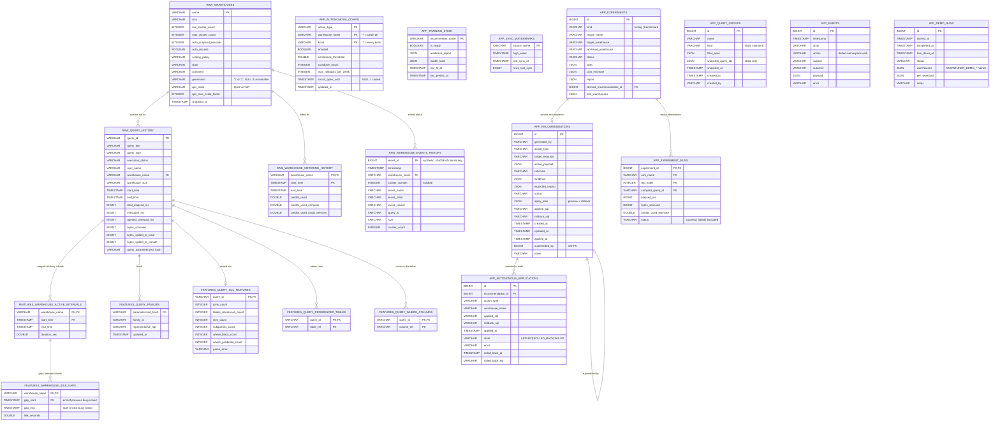

# DuckDB schema

Single source of truth: [`src/snowtuner/storage/schema.py`](../src/snowtuner/storage/schema.py).

Three logical schemas:

- **`raw.*`** - mirrors of Snowflake views/SHOW output. Populated by
  `ingestion/sources/*`. Treat as append-only telemetry.
- **`features.*`** - derived tables computed by `features/library/*` transforms.
  Recomputed each run; idempotent.
- **`app.*`** - application state: recommendations, training state, sync
  watermarks, autonomous config and applications, experiments and their runs,
  saved query groups, the audit event stream, and demo-run tracking.

## Entity-relationship diagram

```mermaid
erDiagram
    %% ── raw.* (Snowflake mirrors) ───────────────────────────────
    RAW_WAREHOUSES {
        VARCHAR name PK
        VARCHAR size
        INTEGER min_cluster_count
        INTEGER max_cluster_count
        INTEGER auto_suspend_seconds
        BOOLEAN auto_resume
        VARCHAR scaling_policy
        VARCHAR state
        VARCHAR comment
        VARCHAR generation "'1' or '2'; NULL if unavailable"
        VARCHAR qas_state "QAS 'on'/'off'"
        INTEGER qas_max_scale_factor
        TIMESTAMP snapshot_at
    }

    RAW_QUERY_HISTORY {
        VARCHAR query_id PK
        VARCHAR query_text
        VARCHAR query_type
        VARCHAR execution_status
        VARCHAR user_name
        VARCHAR warehouse_name FK
        VARCHAR warehouse_size
        TIMESTAMP start_time
        TIMESTAMP end_time
        BIGINT total_elapsed_ms
        BIGINT execution_ms
        BIGINT queued_overload_ms
        BIGINT bytes_scanned
        BIGINT bytes_spilled_to_local
        BIGINT bytes_spilled_to_remote
        VARCHAR query_parameterized_hash
    }

    RAW_WAREHOUSE_METERING_HISTORY {
        VARCHAR warehouse_name PK,FK
        TIMESTAMP start_time PK
        TIMESTAMP end_time
        DOUBLE credits_used
        DOUBLE credits_used_compute
        DOUBLE credits_used_cloud_services
    }

    RAW_WAREHOUSE_EVENTS_HISTORY {
        BIGINT event_id PK "synthetic; sha256 of natural key"
        TIMESTAMP timestamp
        VARCHAR warehouse_name FK
        INTEGER cluster_number "nullable"
        VARCHAR event_name
        VARCHAR event_state
        VARCHAR event_reason
        VARCHAR query_id
        VARCHAR size
        INTEGER cluster_count
    }

    %% ── features.* (derived) ────────────────────────────────────
    FEATURES_WAREHOUSE_ACTIVE_INTERVALS {
        VARCHAR warehouse_name PK,FK
        TIMESTAMP start_time PK
        TIMESTAMP end_time
        DOUBLE duration_sec
    }

    FEATURES_WAREHOUSE_IDLE_GAPS {
        VARCHAR warehouse_name PK,FK
        TIMESTAMP gap_start PK "end of previous busy island"
        TIMESTAMP gap_end "start of next busy island"
        DOUBLE idle_seconds
    }

    FEATURES_QUERY_FAMILIES {
        VARCHAR parameterized_hash PK
        VARCHAR family_id
        VARCHAR representative_sql
        TIMESTAMP updated_at
    }

    FEATURES_QUERY_SQL_FEATURES {
        VARCHAR query_id PK,FK
        INTEGER joins_count
        INTEGER tables_referenced_count
        INTEGER ctes_count
        INTEGER subqueries_count
        INTEGER where_block_count
        INTEGER where_predicate_count
        VARCHAR parse_error
    }

    FEATURES_QUERY_REFERENCED_TABLES {
        VARCHAR query_id PK,FK
        VARCHAR table_ref PK
    }

    FEATURES_QUERY_WHERE_COLUMNS {
        VARCHAR query_id PK,FK
        VARCHAR column_ref PK
    }

    %% ── app.* (state) ───────────────────────────────────────────
    APP_RECOMMENDATIONS {
        BIGINT id PK
        VARCHAR generated_by
        VARCHAR action_type
        VARCHAR target_resource
        JSON action_payload
        VARCHAR rationale
        JSON evidence
        JSON expected_impact
        VARCHAR status
        JSON apply_plan "preview + rollback"
        VARCHAR applied_sql
        VARCHAR rollback_sql
        TIMESTAMP created_at
        TIMESTAMP updated_at
        TIMESTAMP applied_at
        BIGINT superseded_by "self-FK"
        VARCHAR notes
    }

    APP_AUTONOMOUS_CONFIG {
        VARCHAR action_type PK
        VARCHAR warehouse_name PK "'*' = catch-all"
        VARCHAR knob PK "'*' = every knob"
        BOOLEAN enabled
        DOUBLE confidence_threshold
        INTEGER cooldown_hours
        INTEGER max_rollbacks_per_week
        TIMESTAMP circuit_open_until "NULL = closed"
        TIMESTAMP updated_at
    }

    APP_AUTONOMOUS_APPLICATIONS {
        BIGINT id PK
        BIGINT recommendation_id FK
        VARCHAR action_type
        VARCHAR warehouse_name
        VARCHAR applied_sql
        VARCHAR rollback_sql
        TIMESTAMP applied_at
        VARCHAR state "APPLIED|ROLLED_BACK|FAILED"
        VARCHAR error
        TIMESTAMP rolled_back_at
        VARCHAR rolled_back_sql
    }

    APP_TRAINING_STATE {
        VARCHAR recommender_name PK
        BOOLEAN is_ready
        JSON readiness_report
        JSON model_state
        TIMESTAMP last_fit_at
        TIMESTAMP last_predict_at
    }

    APP_SYNC_WATERMARKS {
        VARCHAR source_name PK
        TIMESTAMP high_water
        TIMESTAMP last_sync_at
        BIGINT rows_last_sync
    }

    APP_EXPERIMENTS {
        BIGINT id PK
        VARCHAR kind "tuning | benchmark"
        VARCHAR recipe_name
        VARCHAR target_warehouse
        VARCHAR workload_warehouse
        VARCHAR status
        JSON spec
        JSON cost_estimate
        JSON report
        BIGINT derived_recommendation_id "FK"
        JSON test_warehouses
    }

    APP_EXPERIMENT_RUNS {
        BIGINT experiment_id PK,FK
        VARCHAR arm_name PK
        INTEGER rep_index PK
        VARCHAR sampled_query_id PK
        BIGINT elapsed_ms
        BIGINT bytes_scanned
        DOUBLE credits_used_estimate
        VARCHAR status "success | failed | excluded"
    }

    APP_QUERY_GROUPS {
        BIGINT id PK
        VARCHAR name
        VARCHAR kind "static | dynamic"
        JSON filter_spec
        JSON snapshot_query_ids "static only"
        TIMESTAMP snapshot_at
        TIMESTAMP created_at
        VARCHAR created_by
    }

    APP_EVENTS {
        BIGINT id PK
        TIMESTAMP timestamp
        VARCHAR actor
        VARCHAR action "dotted-namespace verb"
        VARCHAR subject
        VARCHAR outcome
        JSON payload
        VARCHAR error
    }

    APP_DEMO_RUNS {
        BIGINT id PK
        TIMESTAMP started_at
        TIMESTAMP completed_at
        TIMESTAMP torn_down_at
        VARCHAR status
        JSON warehouses "SNOWTUNER_DEMO_* names"
        JSON per_workload
        VARCHAR notes
    }

    %% ── relationships ───────────────────────────────────────────
    RAW_WAREHOUSES ||--o{ RAW_QUERY_HISTORY : "queries run on"
    RAW_WAREHOUSES ||--o{ RAW_WAREHOUSE_METERING_HISTORY : "billed for"
    RAW_WAREHOUSES ||--o{ RAW_WAREHOUSE_EVENTS_HISTORY : "events about"
    RAW_QUERY_HISTORY ||--o{ FEATURES_WAREHOUSE_ACTIVE_INTERVALS : "merged into busy islands"
    FEATURES_WAREHOUSE_ACTIVE_INTERVALS ||--o{ FEATURES_WAREHOUSE_IDLE_GAPS : "gaps between islands"
    RAW_QUERY_HISTORY ||--o{ FEATURES_QUERY_FAMILIES : "feeds"
    RAW_QUERY_HISTORY ||--o| FEATURES_QUERY_SQL_FEATURES : "parsed into"
    RAW_QUERY_HISTORY ||--o{ FEATURES_QUERY_REFERENCED_TABLES : "tables read"
    RAW_QUERY_HISTORY ||--o{ FEATURES_QUERY_WHERE_COLUMNS : "columns filtered on"
    APP_RECOMMENDATIONS ||--o{ APP_AUTONOMOUS_APPLICATIONS : "recorded in audit"
    APP_RECOMMENDATIONS ||--o| APP_RECOMMENDATIONS : "superseded by"
    APP_EXPERIMENTS ||--o{ APP_EXPERIMENT_RUNS : "replay observations"
    APP_EXPERIMENTS ||--o| APP_RECOMMENDATIONS : "derives on completion"
```

> **Note:** the diagram shows primary keys, the columns consumers query most,
> and logical relationships; `storage/schema.py` carries the full column list
> for every table. DuckDB-level FOREIGN KEY constraints are not declared, so
> the arrows above are *logical* relationships used by joins. We accept the
> occasional orphan row (e.g. an `app.autonomous_applications` whose
> `recommendation_id` got purged) and clean up in migrations as needed.

## Table notes

### `raw.query_history`

Mirror of `SNOWFLAKE.ACCOUNT_USAGE.QUERY_HISTORY`. Watermark column is
`start_time`. Primary key is the Snowflake-provided `query_id` (always non-null).

What we use it for: query counts, queue time, spill detection, last-query-end
timestamp for idle-gap computation.

### `raw.warehouse_metering_history`

Hourly per-warehouse credit usage from
`SNOWFLAKE.ACCOUNT_USAGE.WAREHOUSE_METERING_HISTORY`. Composite PK on
`(warehouse_name, start_time)` because Snowflake emits one row per hourly
billing window per warehouse.

What we use it for: estimating credit-delta impact of right-sizing
recommendations (`new_credits = observed_credits * size_ratio`).

### `raw.warehouse_events_history`

Resume / suspend / resize / multi-cluster events from
`SNOWFLAKE.ACCOUNT_USAGE.WAREHOUSE_EVENTS_HISTORY`. Snowflake doesn't expose a
surrogate event id, so we synthesize `event_id` as the sha256 (first 8 bytes,
signed BIGINT) of the natural key `(timestamp, warehouse_id, event_name,
cluster_number)`. This gives idempotent re-syncs at the watermark boundary
without a NULL-sentinel hack on `cluster_number`.

What we use it for: measured cold-start cost for the auto_suspend
recommender (resume STARTED→COMPLETED durations), plus suspend/resume
counters in the UI and `snowtuner status`. No longer the source of the
gap distribution - see `features.warehouse_idle_gaps`.

### `raw.warehouses`

Full-refresh snapshot of `SHOW WAREHOUSES`. Watermark column is `None` -
we DELETE + INSERT each sync. The `size` column is the non-canonical form
Snowflake returns (e.g. `"X-Small"`); use `recommenders/sizes.normalize` to
get a canonical form.

> **Known issue (v0.1):** when autonomous mode applies an `ALTER WAREHOUSE`
> change, this table doesn't get patched in-place - only the next full sync
> sees the new value. This means a re-`run` between syncs may emit a duplicate
> recommendation. Fix queued for a v0.1 patch.

### `features.warehouse_idle_gaps`

True idle gaps per warehouse: the space between consecutive busy periods,
computed purely from `raw.query_history`. Compute-bearing statements
(`COALESCE(execution_ms, total_elapsed_ms, 0) > 0` - excludes USE/SHOW and
other metadata-only rows that wouldn't resume a suspended warehouse) are
merged into busy islands via a running-max interval sweep; the gaps between
islands land here. The trailing gap after the last island is right-censored
and not emitted.

Deliberately NOT event-anchored. The earlier event-based definition (last
query end to suspend event) had two structural flaws: it only observed gaps
that exceeded the configured AUTO_SUSPEND (censoring - warehouses that never
suspend were invisible, despite being the best tuning candidates), and the
measured value approximated the configured setting itself rather than the
workload's gap structure.

What it feeds: `auto_suspend_survival_tuner` - the gap distribution is its
primary input.

### `features.warehouse_active_intervals`

Merged busy islands per warehouse - the intermediate for the gap
computation above. Also feeds the cold-start cost's billing-floor term:
`max(0, 60s - median busy duration)` estimates the per-resume waste from
Snowflake's minimum billing increment.

### `features.query_families`

Maps each parameterized SQL hash to a stable family id. v0.1 implementation:
one family per `parameterized_hash`. v0.2 will replace this with structural
clustering (cosine similarity on AST node-frequency vectors), preserving the
downstream contract.

### `app.recommendations`

Every recommendation ever emitted. Status moves through
`PROPOSED → ACCEPTED | REJECTED | SUPERSEDED` (advisory) or
`PROPOSED → APPLIED → ROLLED_BACK` (autonomous). The `superseded_by` column
self-references this table when one recommendation supersedes another.

`action_payload` is the polymorphic `Action` model serialized as JSON;
hydrate with `actions.registry.action_from_dict`.

### `app.autonomous_config`

Per `(action_type, warehouse_name, knob)` config controlling whether
autonomous mode applies. The `knob` column gates granularly inside an action
type, so a warehouse can run autonomous AUTO_SUSPEND tuning while keeping
WAREHOUSE_SIZE changes advisory. Catch-all rows use the literal string `'*'`
for `warehouse_name` and `knob` (DuckDB primary keys disallow NULL); more
specific rows override the catch-all.

When `circuit_open_until` is non-NULL and in the future, autonomous skips
this `(action_type, warehouse_name)` until the timestamp passes - set by the
runner when rollback budget is exhausted.

### `app.autonomous_applications`

Audit log of every autonomous apply. Each row records the SQL that ran, the
rollback SQL it would run, when, the recommendation it came from, and the
current state. Rollback execution updates the same row in place
(`state` flips to `ROLLED_BACK`, `rolled_back_at` set, `rolled_back_sql`
records what actually executed).

### `app.training_state`

One row per registered recommender. `is_ready` mirrors the most-recent
training-gate evaluation. `model_state` is opaque per-recommender JSON
(survival curves, cost grids, observed-distribution stats, etc.).

### `app.sync_watermarks`

Per ingestion source: highest watermark column value seen, last sync
timestamp, row count from last sync. Drives incremental ingestion.

### `app.events`

Append-only audit stream: one chronological feed of state-changing operator
actions, AutomationLoop tick transitions, per-source sync outcomes, experiment
lifecycle, and autonomous applies. Read-only API calls are not logged. It
answers "what changed between 9 and 10am?" without joining five tables.
Indexed on `timestamp`, `(action, timestamp)`, and `(actor, timestamp)`.
Archived to `~/.snowtuner/audit-archive/events-*.json` before a reset wipes it.

### `app.experiments` and `app.experiment_runs`

State for the replay-experiments framework. `experiments` holds one row per
proposed experiment; the full `ProposedExperiment` lives in the `spec` JSON so
the engine can reproduce a run from the row alone, and the statistical report
lands in `report`. `experiment_runs` holds the per-`(arm, query, rep)`
observations the aggregation step reads, keyed by `(experiment_id, arm_name,
rep_index, sampled_query_id)`. A completed experiment sets
`derived_recommendation_id`, linking back to the `app.recommendations` row it
produced.

### `app.query_groups`

Saved sets of queries used as workload filters or experiment inputs. `static`
groups snapshot their membership at creation (`snapshot_query_ids`); `dynamic`
groups re-evaluate `filter_spec` against `raw.query_history` on every read.

### `app.demo_runs`

Tracks `snowtuner demo` runs: which `SNOWTUNER_DEMO_*` warehouses were
provisioned, the per-workload results, and the run's lifecycle
(`RUNNING → COMPLETED | FAILED → TORN_DOWN`).

### `features.query_sql_features`, `query_referenced_tables`, `query_where_columns`

AST-derived structure for each query, computed by `QuerySqlFeaturesTransform`
in one parse pass. `query_sql_features` holds per-query counts (joins, CTEs,
subqueries, WHERE predicates); the two side tables record which tables a query
reads and which columns it filters on, list-valued so the explorer can answer
"queries that touch table X but don't filter on column Y". Counts are NULL and
`parse_error` is set when `query_text` was redacted or unparseable.

## Schema migrations

Pre-1.0: **almost no migrations.**  [`storage/schema.py`](../src/snowtuner/storage/schema.py)
holds the canonical DDL; when a table shape changes during development we
ship `snowtuner reset` + `snowtuner sync` instead of carrying schema-evolution
shims.  The one exception is derived `features.*` tables: because they rebuild
from `raw.*` on every pipeline run, `_forward_migrations` in `schema.py` drops
an outdated shape in place rather than forcing a reset (it currently repairs
the pre-rewrite `warehouse_idle_gaps`).  The reset path is acceptable because
`raw.*` is fully repopulatable from Snowflake and
`reset` preserves user-authored config (`app.query_groups`,
`app.autonomous_config`) by default while archiving
`app.autonomous_applications` to `~/.snowtuner/audit-archive/` before
deletion.  See [docs/architecture.md](architecture.md) and
[docs/configuration.md](configuration.md) for the preservation defaults.

For backfilling more history without a destructive reset, use
`snowtuner backfill --days N` - it resets just `app.sync_watermarks` and
re-pulls, leaving every other table untouched.

A real migration framework (Alembic-style versioned files or DuckDB-native
`ALTER TABLE` shims) will land before v1.0.
